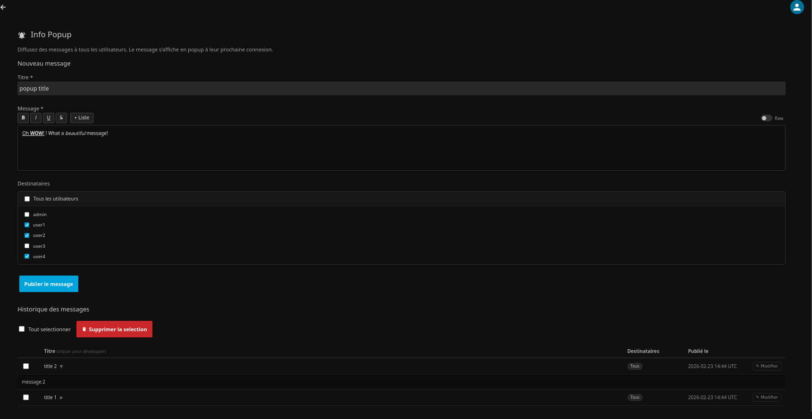
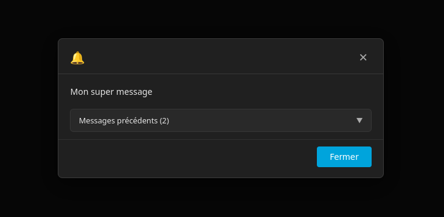
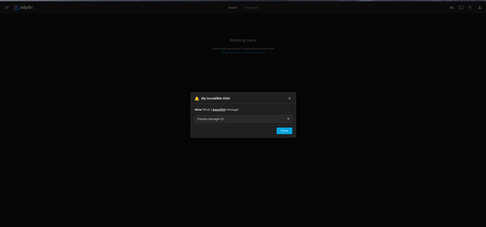

# jellyfin-info-popup-extention


A Jellyfin plugin that allows administrators to display popup messages to users when they log in.

## Table of Contents
- [📸 Preview](#-preview)
- [Features](#features)
  - [Key Features](#key-features)
  - [Admin & Editing Features](#admin--editing-features)
  - [Formatting & UI](#formatting--ui)
  - [Technical & Security](#technical--security)
- [Installation](#installation)
  - [Install via Repository (Recommended)](#install-via-repository-recommended)
  - [Manual Installation](#manual-installation)
- [Message Formatting Syntax](#message-formatting-syntax)
- [Development](#development)
  - [Prerequisites](#prerequisites)
  - [Initial setup](#initial-setup)
  - [Available commands](#available-commands)
  - [Release workflow](#release-workflow)
  - [Cleaning build artifacts from the repository](#cleaning-build-artifacts-from-the-repository)
- [Architecture](#architecture)
- [Compatibility](#compatibility)
- [License](#license)
- [Contributing](#contributing)

This extension was almost entirely vibe-coded by Claude. That's intentional: I simply needed such an extension and didn't want to embark on a ten-day development project.

---

## 📸 Preview


*Config page with message edition*

*Config page with message published*

*Example popup render*

---

## Features

### Key Features
- **Multilingual UI** – Admin page and user popup automatically displayed in the user's Jellyfin language (English, French, Spanish, German, Portuguese, Italian, Japanese, Chinese Simplified). Falls back to English for other languages.  
- **Login popup** – Detects user login via MutationObserver (SPA-compatible, tested on Jellyfin 10.10–10.11).  
- **Show once per user** – Server-side tracking; works across all devices (no localStorage).  
- **Targeted messages** – Administrator can choose which users will receive each message.  
- **Multiple unread messages** – Each unread message appears in its own card (title + body) within the same popup.  
- **Collapsible history** – Previously seen messages are shown in a collapsed accordion; body can be expanded on click.  
- **Edit or delete without re-display** – Administrators can edit or delete old messages; users who already saw them will not see them again.

### Admin & Editing Features
- **Admin page** – Publish, edit, and delete messages; multiple selection supported.  
- **Edit without re-display** – Edited messages keep their ID; users who already saw them won’t see them again.  
- **Editable targeting on edit** – Recipient selector is pre-filled; title, body, and recipients can all be changed in one operation.  
- **Inline row expand** – Click a message title in the admin table to view its body inline.  
- **Full deletion** – Deleted messages disappear immediately for all users.  

### Formatting & UI
- **Body formatting** – Lightweight syntax: `**bold**`, `_italic_`, `__underline__`, `~~strikethrough~~`, `- list` lines.  
- **Formatting toolbar** – Buttons above the textarea apply formatting without manually typing syntax.  
- **Optional formatted preview** – Preview panel below textarea; always-visible textarea.  
- **Jellyfin theme integration** – Uses native CSS variables and standard dashboard classes.  

### Technical & Security
- **Auto-injection** – `client.js` injected into `index.html` via ScriptInjectionMiddleware; no manual modification required.  
- **XSS security** – `escHtml()` applied before rendering; no raw HTML in the DOM.  
- **Targeting access control** – Users only see messages intended for them, including via direct API.

---

## Installation

### Install via Repository (Recommended)
1. Open Jellyfin Dashboard → Plugins → Repositories → Add.
2. Paste this URL:
https://raw.githubusercontent.com/crocodile13/jellyfin-info-popup-extention/main/manifest.json
3. Install **Info Popup** from the catalogue.
4. Restart Jellyfin.

> ⚠️ Docker fallback: if your container mounts a custom `index.html` overriding Jellyfin-Web, manually add before `</body>`:
> ```html
> <script src="/InfoPopup/client.js"></script>
> ```

---

### Manual Installation
1. Download `infopopup_X.Y.Z.0.zip` from [Releases](../../releases).  
2. Extract `Jellyfin.Plugin.InfoPopup.dll` into:
   - Linux: `~/.local/share/jellyfin/plugins/InfoPopup/`
   - Docker: `/config/plugins/InfoPopup/`
3. Restart Jellyfin.

## Message formatting syntax

The message body supports a lightweight syntax:

| Syntax | Render |
|--------|--------|
| `**text**` | **bold** |
| `_text_` | *italic* |
| `__text__` | underline |
| `~~text~~` | strikethrough |
| Line starting with `- ` | bulleted list item |

Formatting is rendered in the user popup, in the history, and in the admin table expand rows.

---

## Development

### Prerequisites

| Tool | Version |
|------|---------|
| [.NET SDK](https://dotnet.microsoft.com) | 8.x |
| [git](https://git-scm.com) | >= 2.x |
| [jq](https://stedolan.github.io/jq/) | >= 1.6 |
| [GitHub CLI](https://cli.github.com) | >= 2.x |

### Initial setup

```bash
git clone https://github.com/YOUR_ACCOUNT/jellyfin-info-popup-extention
cd jellyfin-info-popup-extention

cp .env.make.example .env.make
# Edit .env.make: GITHUB_USER = your-login

make check
```

### Available commands

```bash
make              # Help + Jellyfin repository URL

make build        # Compile in Debug
make pack         # Compile Release + create ZIP in dist/
make clean        # Clean bin/, obj/, dist/*.zip

make bump-patch   # 0.4.0.0 -> 0.4.1.0
make bump-minor   # 0.4.0.0 -> 0.5.0.0
make bump-major   # 0.4.0.0 -> 1.0.0.0

make release-patch
make release-minor
make release-major
```

### Release workflow

```bash
# 1. Add your changes to CHANGELOG.md
# 2. Run the release
make release-minor   # or patch / major
```

### Cleaning build artifacts from the repository

If `bin/` and `obj/` were committed by mistake before being in `.gitignore`:

```bash
git rm -r --cached Jellyfin.Plugin.InfoPopup/bin/ Jellyfin.Plugin.InfoPopup/obj/
git commit -m "chore: untrack bin/ and obj/ build artifacts"
```

---

## Architecture

```
REST API (/InfoPopup/*)               JS Client (injected into index.html)
┌─────────────────────────────────┐   ┌────────────────────────────────────────────┐
│ GET    /messages          [user]│   │ ScriptInjectionMiddleware → index.html     │
│ GET    /messages/{id}     [user]│◄──│ MutationObserver → all SPA navigation      │
│ POST   /messages         [ADMIN]│   │ Guards: popupActive, #infoPopupConfigPage  │
│ PUT    /messages/{id}    [ADMIN]│   │ GET /InfoPopup/popup-data (1 single call)  │
│ POST   /messages/delete  [ADMIN]│   │ showPopup() → renderBody() → innerHTML     │
│ GET    /popup-data        [user]│   │ close → POST /seen → popupActive=false     │
│ GET    /unseen            [user]│   └────────────────────────────────────────────┘
│ POST   /seen              [user]│
│ GET    /client.js         [anon]│   Admin Page (Jellyfin dashboard)
└─────────────────────────────────┘   ┌────────────────────────────────────────────┐
                                       │ POST /messages        → publish            │
Access control                         │ PUT  /messages/{id}   → edit (stable ID,  │
┌─────────────────────────────────┐   │                          title/body/target)│
│ Admins: all messages            │   │ POST /messages/delete → confirm modal      │
│ Users:  targeted only           │   │ GET  /messages        → table + editing    │
│ Missing UserId → 401            │   │ Toolbar: B I U S • List (always on textarea│
│ Not targeted → 404 (not 403)    │   │ Preview toggle: optional panel below       │
└─────────────────────────────────┘   └────────────────────────────────────────────┘

                                       Persistence
                                       ┌────────────────────────────────────────────┐
                                       │ XML  : messages (BasePluginConfiguration)  │
                                       │ JSON : infopopup_seen.json (memory cache)  │
                                       └────────────────────────────────────────────┘
```

---

## Compatibility

| Jellyfin | .NET | Status |
|----------|------|--------|
| 10.10.x  | 8.0  | Supported |
| 10.11.x  | 8.0  | Tested (React/MUI dashboard) |

---

## License
GPL3

## Contributing
If you modify the code, add features or fix bugs, please share your work!
