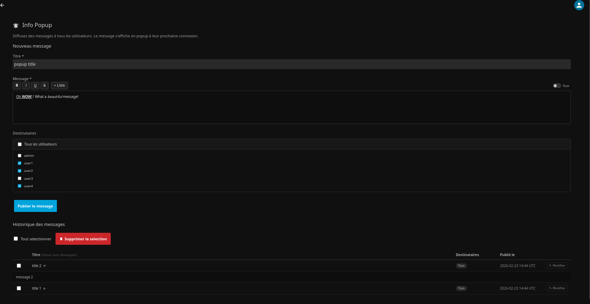
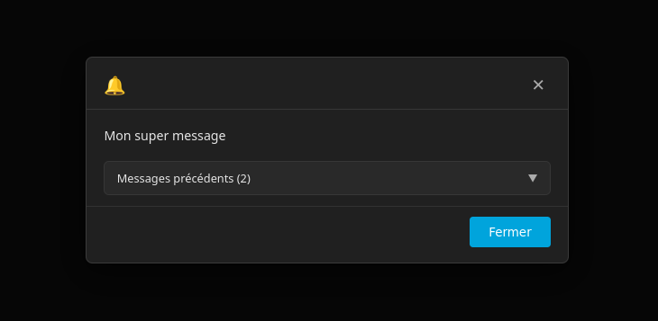
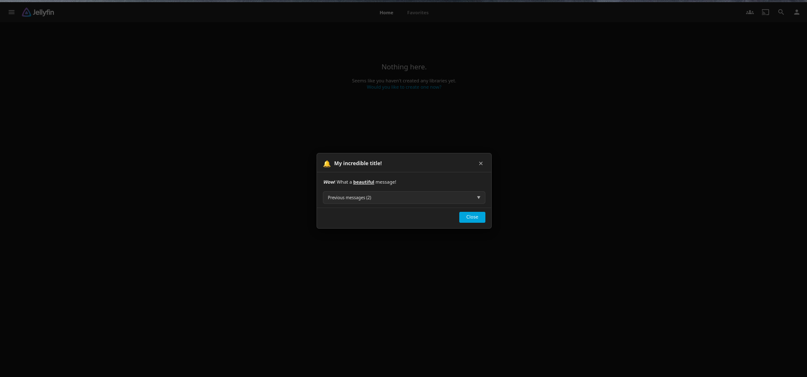

# jellyfin-info-popup-extention


A Jellyfin plugin that allows administrators to broadcast popup messages to users when they log in, with per-user permissions, reply system, and a full user messaging page.

## Table of Contents
- [Preview](#-preview)
- [Features](#features)
  - [Key Features](#key-features)
  - [User Messages Page](#user-messages-page)
  - [Admin & Editing Features](#admin--editing-features)
  - [Reply System](#reply-system)
  - [Permissions & Settings](#permissions--settings)
  - [Formatting & UI](#formatting--ui)
  - [Technical & Security](#technical--security)
- [Installation](#installation)
  - [Install via Repository (Recommended)](#install-via-repository-recommended)
  - [Manual Installation](#manual-installation)
- [Message Formatting Syntax](#message-formatting-syntax)
- [Development](#development)
  - [Prerequisites](#prerequisites)
  - [Initial setup](#initial-setup)
  - [Available commands](#available-commands)
  - [Release workflow](#release-workflow)
  - [Cleaning build artifacts from the repository](#cleaning-build-artifacts-from-the-repository)
- [Architecture](#architecture)
- [Compatibility](#compatibility)
- [License](#license)
- [Contributing](#contributing)

This extension was almost entirely vibe-coded by Claude. That's intentional: I simply needed such an extension and didn't want to embark on a ten-day development project.

---

## Preview


*Config page with message edition*

*Config page with message published*

*Example popup render*

---

## Features

### Key Features
- **Multilingual UI** -- Admin page, user page and popup automatically displayed in the user's Jellyfin language (English, French, Spanish, German, Portuguese, Italian, Japanese, Chinese Simplified). Falls back to English for other languages.
- **Login popup** -- Detects user login via MutationObserver (SPA-compatible, tested on Jellyfin 10.10-10.11).
- **Auto-close countdown** -- Optional progress bar that counts down before closing the popup automatically. Set to 0 for manual close only.
- **Show once per user** -- Server-side tracking; works across all devices (no localStorage).
- **Targeted messages** -- Choose which users will receive each message.
- **Multiple unread messages** -- Each unread message appears in its own card within the same popup.
- **Collapsible history** -- Previously seen messages shown in a collapsed accordion; body expanded on click.
- **Edit or delete without re-display** -- Edited or deleted messages don't re-appear for users who already saw them.

### User Messages Page
- **Sidebar entry for all users** -- A "Messages" entry is injected into the Jellyfin sidebar via JavaScript, visible to all authenticated users (not just admins).
- **Collapsible inbox** -- Received messages are collapsed by default showing title, author, date and a preview. Click to expand the full body.
- **Compose with formatting** -- Users with `CanSendMessages` permission see a Send tab with a formatting toolbar (bold, italic, underline, strikethrough, list).
- **Recipient picker** -- Target specific users or send to everyone.
- **Sent messages history** -- View previously sent messages.

### Admin & Editing Features
- **Admin config page** -- Three tabs: Messages (publish/edit/delete), Settings, Replies viewer.
- **WYSIWYG editor** -- Rich text editing with Raw mode toggle for direct markdown input.
- **Edit without re-display** -- Edited messages keep their ID; users who already saw them won't see them again.
- **Editable targeting on edit** -- Recipient selector pre-filled with current targets.
- **Inline row expand** -- Click a message title in the admin table to view its body inline.
- **Full deletion** -- Deleted messages disappear immediately for all users. Cascades to replies.

### Reply System
- **User replies** -- Users can reply to popup messages (if `AllowReplies` is enabled globally and per-user).
- **Reply viewer** -- Admin Replies tab shows all replies grouped by message, with individual or bulk delete.
- **Rate limiting** -- Configurable daily limits per user for messages and replies.

### Permissions & Settings
- **Per-user permissions** -- Admin can configure per user: `CanSendMessages`, `CanReply`, `CanEditOwnMessages`, `CanDeleteOwnMessages`, `CanEditOthersMessages`, `CanDeleteOthersMessages`, `MaxMessagesPerDay`, `MaxRepliesPerDay`.
- **Global settings** -- Popup enabled/disabled, auto-close duration, max messages in popup, allow replies, history enabled, rate limit, message retention (admin/user).
- **Client settings endpoint** -- Non-sensitive settings exposed via `[AllowAnonymous]` endpoint for the popup JS.

### Formatting & UI
- **Body formatting** -- Lightweight syntax: `**bold**`, `_italic_`, `__underline__`, `~~strikethrough~~`, `- list` lines.
- **Formatting toolbar** -- Buttons above the editor apply formatting in both admin and user compose forms.
- **WYSIWYG + Raw toggle** -- Admin editor supports rich text editing or direct markdown input.
- **Jellyfin theme integration** -- Uses native CSS variables and standard dashboard classes.
- **Keyboard shortcut isolation** -- Plugin input fields block Jellyfin global shortcuts (e.g., "q" for Quick Connect) while typing.

### Technical & Security
- **Auto-injection** -- `client.js` injected into `index.html` via ScriptInjectionMiddleware; no manual modification required.
- **Modular JS architecture** -- Sequential loader: `ip-i18n.js` -> `ip-utils.js` -> `ip-styles.js` -> `ip-admin.js` -> `ip-popup.js` -> `ip-user.js`. All communication via `window.__IP` namespace.
- **XSS security** -- `escHtml()` applied before rendering; no raw HTML in the DOM.
- **Input validation** -- Client-side and server-side validation on all inputs (title length, body length, reply length, settings ranges, GUID format).
- **Targeting access control** -- Users only see messages intended for them, including via direct API. Returns 404 (not 403) for non-targeted messages.

---

## Installation

### Install via Repository (Recommended)
1. Open Jellyfin Dashboard -> Plugins -> Repositories -> Add.
2. Paste this URL:
https://raw.githubusercontent.com/crocodile13/jellyfin-info-popup-extention/main/manifest.json
3. Install **Info Popup** from the catalogue.
4. Restart Jellyfin.

> Docker fallback: if your container mounts a custom `index.html` overriding Jellyfin-Web, manually add before `</body>`:
> ```html
> <script src="/InfoPopup/client.js"></script>
> ```

---

### Manual Installation
1. Download `infopopup_X.Y.Z.0.zip` from [Releases](../../releases).
2. Extract `Jellyfin.Plugin.InfoPopup.dll` into:
   - Linux: `~/.local/share/jellyfin/plugins/InfoPopup/`
   - Docker: `/config/plugins/InfoPopup/`
3. Restart Jellyfin.

## Message formatting syntax

The message body supports a lightweight syntax:

| Syntax | Render |
|--------|--------|
| `**text**` | **bold** |
| `_text_` | *italic* |
| `__text__` | underline |
| `~~text~~` | strikethrough |
| Line starting with `- ` | bulleted list item |

Formatting is rendered in the user popup, in the history, in the inbox, and in the admin table expand rows.

---

## Development

### Prerequisites

| Tool | Version |
|------|---------|
| [.NET SDK](https://dotnet.microsoft.com) | 9.x |
| [git](https://git-scm.com) | >= 2.x |
| [jq](https://stedolan.github.io/jq/) | >= 1.6 |
| [GitHub CLI](https://cli.github.com) | >= 2.x |

### Initial setup

```bash
git clone https://github.com/YOUR_ACCOUNT/jellyfin-info-popup-extention
cd jellyfin-info-popup-extention

cp .env.make.example .env.make
# Edit .env.make: GITHUB_USER = your-login

make check
```

### Available commands

```bash
make              # Help + Jellyfin repository URL

make build        # Compile in Debug
make pack         # Compile Release + create ZIP in dist/
make clean        # Clean bin/, obj/, dist/*.zip

make bump-patch   # 0.4.0.0 -> 0.4.1.0
make bump-minor   # 0.4.0.0 -> 0.5.0.0
make bump-major   # 0.4.0.0 -> 1.0.0.0

make release-patch
make release-minor
make release-major
make release-hotfix  # Recompile + re-upload ZIP, no version bump
```

### Release workflow

```bash
# 1. Add your changes to CHANGELOG.md
# 2. Run the release
make release-minor   # or patch / major
```

### Cleaning build artifacts from the repository

If `bin/` and `obj/` were committed by mistake before being in `.gitignore`:

```bash
git rm -r --cached Jellyfin.Plugin.InfoPopup/bin/ Jellyfin.Plugin.InfoPopup/obj/
git commit -m "chore: untrack bin/ and obj/ build artifacts"
```

---

## Architecture

```
REST API (/InfoPopup/*)               JS Client (injected into index.html)
+---------------------------------+   +--------------------------------------------+
| GET    /messages          [user]|   | ScriptInjectionMiddleware -> index.html    |
| GET    /messages/{id}     [user]|<--| MutationObserver -> all SPA navigation     |
| POST   /messages         [auth]|   | Guards: popupActive, #infoPopupConfigPage  |
| PUT    /messages/{id}    [auth]|   | GET /InfoPopup/popup-data (1 single call)  |
| POST   /messages/delete [ADMIN]|   | showPopup() -> renderBody() -> innerHTML   |
| GET    /popup-data        [user]|   | close -> POST /seen -> popupActive=false   |
| POST   /seen              [user]|   +--------------------------------------------+
| POST   /messages/{id}/reply     |
|                           [user]|   Admin Page (Jellyfin dashboard)
| GET    /replies          [ADMIN]|   +--------------------------------------------+
| DELETE /replies/{id}     [ADMIN]|   | Tabs: Messages | Settings | Replies        |
| GET    /settings         [ADMIN]|   | WYSIWYG editor + Raw toggle                |
| POST   /settings         [ADMIN]|   | Toolbar: B I U S * List                    |
| GET    /client-settings   [anon]|   | Target picker: all/individual users        |
| GET    /permissions      [ADMIN]|   | Table: inline expand, edit, multi-delete   |
| GET    /permissions/me    [user]|   +--------------------------------------------+
| PUT    /permissions/{id} [ADMIN]|
| GET    /{module}.js       [anon]|   User Page (sidebar, all users)
+---------------------------------+   +--------------------------------------------+
                                      | Inbox: collapsible cards (title+author+    |
Access control                        |   date+preview), lazy body loading         |
+---------------------------------+   | Send: formatting toolbar + target picker   |
| Admins: all messages            |   | Sent: sent messages history                |
| Users:  targeted only           |   +--------------------------------------------+
| CanSendMessages: can publish    |
| Missing UserId -> 401           |   Persistence
| Not targeted -> 404 (not 403)   |   +--------------------------------------------+
+---------------------------------+   | XML  : messages + settings (PluginConfig)  |
                                      | JSON : infopopup_seen.json (views cache)   |
                                      | JSON : infopopup_replies.json (replies)    |
                                      | JSON : infopopup_permissions.json (perms)  |
                                      +--------------------------------------------+
```

---

## Compatibility

| Jellyfin | .NET | Status |
|----------|------|--------|
| 10.10.x  | 9.0  | Supported |
| 10.11.x  | 9.0  | Tested (React/MUI dashboard) |

---

## License
GPL3

## Contributing
If you modify the code, add features or fix bugs, please share your work!
