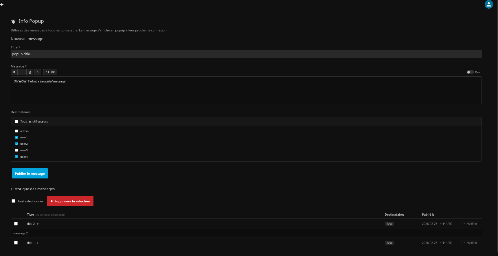
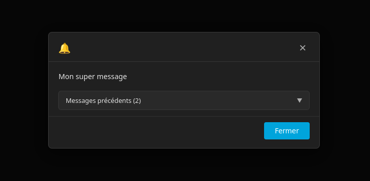
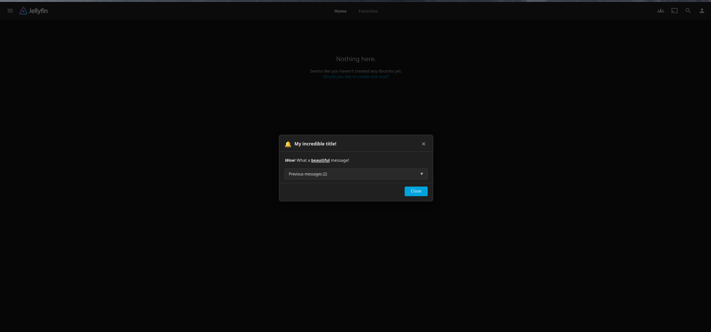

# jellyfin-info-popup-extention


A Jellyfin plugin that allows administrators to broadcast popup messages to users when they log in, with per-user permissions, reply system, and a full user messaging page.

## Table of Contents
- [Preview](#preview)
- [Features at a glance](#features-at-a-glance)
- [Installation](#installation)
- [User Guide](docs/USER_GUIDE.md) — end-user and admin documentation
- [Development](#development)
- [Architecture](#architecture)
- [Compatibility](#compatibility)
- [License](#license)
- [Contributing](#contributing)

This extension was almost entirely vibe-coded by Claude. That's intentional: I simply needed such an extension and didn't want to embark on a ten-day development project.

---

# ⚠️ Warning

This extension is not very stable yet.

It works for broadcasting popups, but the more advanced features related to responses and granular permission management are not stable yet and may not work as expected.

---

## Preview


*Config page with message edition*

*Config page with message published*

*Example popup render*

---

## Features at a glance

- **Login popup** announcing messages broadcast by admins, with multi-message support, optional auto-close countdown, and a collapsible history.
- **Targeted delivery** to specific users or to everyone, with per-user "seen" tracking on the server (works across all devices, no `localStorage`).
- **"My Messages" sidebar entry for every user** opening a full-screen overlay with an Inbox, an optional Send composer, and a Sent history.
- **Reply system** with per-user permissions and a daily quota.
- **Role-based permission management** (Reader, Contributor, Moderator, Custom, Administrator) with bulk apply, search, and a single global save.
- **Read receipts** — each admin message shows who has and hasn't seen it, in a modal.
- **WYSIWYG + Raw editor** with bold / italic / underline / strikethrough / list, keyboard shortcuts, and live formatting in both admin and user compose forms.
- **Maintenance tools** — clear all views, clear all replies, purge soft-deleted messages, reset settings — without uninstalling the plugin.
- **Multilingual UI** — 8 languages (English, French, Spanish, German, Portuguese, Italian, Japanese, Chinese Simplified), auto-detected from the user's Jellyfin language.
- **Reply notifications** — corner toasts when someone replies to a sent message (polled every ~45 s while a Jellyfin tab is active).

➡️ **Detailed walkthroughs and screenshots: [User Guide](docs/USER_GUIDE.md).**

---

## Installation

### Install via Repository (Recommended)
1. Open Jellyfin Dashboard -> Plugins -> Repositories -> Add.
2. Paste this URL:
https://raw.githubusercontent.com/crocodile13/jellyfin-info-popup-extention/main/manifest.json
3. Install **Info Popup** from the catalogue.
4. Restart Jellyfin.

> Docker fallback: if your container mounts a custom `index.html` overriding Jellyfin-Web, manually add before `</body>`:
> ```html
> <script src="/InfoPopup/client.js"></script>
> ```

---

### Manual Installation
1. Download `infopopup_X.Y.Z.0.zip` from [Releases](../../releases).
2. Extract `Jellyfin.Plugin.InfoPopup.dll` into:
   - Linux: `~/.local/share/jellyfin/plugins/InfoPopup/`
   - Docker: `/config/plugins/InfoPopup/`
3. Restart Jellyfin.

> Message body uses a lightweight syntax (`**bold**`, `_italic_`, `__underline__`, `~~strike~~`, `- list`). Full table and editor walkthrough: see the [User Guide](docs/USER_GUIDE.md#message-formatting).

---

## Development

### Prerequisites

| Tool | Version |
|------|---------|
| [.NET SDK](https://dotnet.microsoft.com) | 9.x |
| [git](https://git-scm.com) | >= 2.x |
| [jq](https://stedolan.github.io/jq/) | >= 1.6 |
| [GitHub CLI](https://cli.github.com) | >= 2.x |

### Initial setup

```bash
git clone https://github.com/YOUR_ACCOUNT/jellyfin-info-popup-extention
cd jellyfin-info-popup-extention

cp .env.make.example .env.make
# Edit .env.make: GITHUB_USER = your-login

make check
```

### Release channels (dev / stable)

The repo has two channels managed by the Makefile (see CLAUDE.md for full details):

- **dev** (default) — pushes to the `dev` branch, updates `manifest-dev.json`, tags `vX.Y.Z.W-dev`, marks the GitHub release as *pre-release*. The plugin appears in Jellyfin catalogs as *Info Popup (Dev)*.
- **stable** — pushes to `main`, updates `manifest.json`, marks the GitHub release as final.

Dev manifest URL: `https://raw.githubusercontent.com/crocodile13/jellyfin-info-popup-extention/dev/manifest-dev.json`

### Available commands

```bash
make                       # Help + repository URLs
make check                 # Verify dotnet, git, jq, gh CLI, gh auth

make build                 # Debug build
make build-release         # Release build (no ZIP)
make pack                  # Release build + ZIP in dist/
make clean                 # Delete bin/, obj/, dist/*.zip

make bump-patch            # X.Y.Z.0 -> X.Y.(Z+1).0
make bump-minor            # X.Y.Z.0 -> X.(Y+1).0.0
make bump-major            # X.Y.Z.0 -> (X+1).0.0.0

make release-patch         # Dev: full release on dev channel
make release-minor
make release-major
make release-hotfix        # Recompile + re-upload ZIP, no version bump

make release-patch STABLE=1   # Same on stable channel (run from main)
make promote VERSION_ARG=X.Y.Z.W
                           # Promote a tested dev version to stable
                           # (fast-forward main, clean rebuild)
```

> Never run `make bump-*` separately before `make release-*` — the release target already bumps. Doing both bumps twice.

### Cleaning build artifacts from the repository

If `bin/` and `obj/` were committed by mistake before being in `.gitignore`:

```bash
git rm -r --cached Jellyfin.Plugin.InfoPopup/bin/ Jellyfin.Plugin.InfoPopup/obj/
git commit -m "chore: untrack bin/ and obj/ build artifacts"
```

---

## Architecture

### Layers

```
ScriptInjectionMiddleware → index.html → client.js?v=X.Y.Z.W (versioned URL)
  → ip-i18n.js → ip-utils.js → ip-styles.js
  → ip-admin.js → ip-popup.js → ip-user.js     (window.__IP namespace)
```

The middleware injects an inline retry loader (v4.0.1.0) into `index.html` that fetches `client.js` with backoff to survive post-install 503s. `client.js` is a small sequential loader (~50 lines) that injects the six modules via `<script async=false>` so they fetch in parallel but execute in dependency order. All cross-module communication goes through `window.__IP`.

### REST endpoints

> `[auth]` = authenticated, perms checked. `[user]` = filtered by targeting; admins see everything. `[ADMIN]` = `RequiresElevation`. `[anon]` = `[AllowAnonymous]`.

| Group | Method | Route | Auth |
|-------|--------|-------|------|
| Messages | GET | `/messages` · `/messages/{id}` · `/messages/sent` | user |
|          | GET | `/messages/{id}/views` | ADMIN |
|          | POST / PUT | `/messages` · `/messages/{id}` | auth |
|          | POST | `/messages/delete` | ADMIN |
|          | POST | `/messages/{id}/soft-delete` | auth (perms checked) |
|          | GET | `/popup-data` · `/unseen` | user |
|          | POST | `/seen` | user |
| Replies | POST | `/messages/{id}/reply` | user |
|         | GET | `/messages/{id}/replies` | sender or ADMIN |
|         | GET | `/replies` | ADMIN |
|         | GET | `/replies/received` | user |
|         | DELETE | `/replies/{replyId}` | ADMIN |
|         | POST | `/messages/{id}/replies/delete` | ADMIN |
| Settings | GET / POST | `/settings` | ADMIN |
|          | GET | `/client-settings` | anon |
| Permissions | GET | `/permissions` · `PUT /permissions/{userId}` · `POST /permissions/bulk` | ADMIN |
|             | GET | `/permissions/me` | user |
| Maintenance | POST | `/admin/clear-seen` · `/admin/clear-replies` · `/admin/purge-deleted` · `/admin/reset-settings` | ADMIN |
| Assets | GET | `/{module}.js?v=…` | anon (whitelisted JS module names) |

### Access control invariants

- Missing `Jellyfin-UserId` claim → **401**.
- Non-targeted message read by a non-admin → **404** (not 403, to avoid revealing existence).
- Effective `CanReply` = global `AllowReplies` AND per-user permission, including for admins (master switch).
- Self-sent messages are hidden from "received" views (popup + inbox).
- Editing or deleting a message keeps `infopopup_seen.json` untouched; an edited message is not re-displayed.
- Deleting a message cascades to its replies (handled by the controller, not the store, to avoid circular deps).

### Persistence

| Store | Location | Contents |
|-------|----------|---------|
| Jellyfin XML | standard `PluginConfiguration` | Messages list + global settings |
| `infopopup_seen.json` | plugin data folder | Per-user "seen" message IDs |
| `infopopup_replies.json` | plugin data folder | All replies |
| `infopopup_permissions.json` | plugin data folder | Per-user roles and quotas |

---

## Compatibility

### Jellyfin server

| Jellyfin | .NET | Status |
|----------|------|--------|
| 10.10.x  | 9.0  | Supported |
| 10.11.x  | 9.0  | Tested (React/MUI dashboard) |

### Clients

This plugin's UI is **delivered through the Jellyfin Web client only** (`/web/index.html`). It works on any browser-based or browser-embedded client. It does **not** appear on native clients that bypass the web layer.

| Client | UI / popup | REST data | Notes |
|--------|------------|-----------|-------|
| Web browser (Firefox, Chrome, Safari, Edge…) | ✅ Full | ✅ | Primary target. ES5 client, works on browsers shipped since ~2016. |
| Jellyfin Media Player (desktop) | ✅ Full | ✅ | Embeds the web client (Qt WebEngine / CEF). |
| PWA / installed web app | ✅ Full | ✅ | Same as the browser. |
| Jellyfin for Android (native) | ❌ | ✅ partial | Native UI bypasses web JS — no popup, no inbox sidebar. |
| Jellyfin for Android TV | ❌ | ✅ partial | Same as above. |
| Jellyfin for iOS / Swiftfin / Findroid / Streamyfin | ❌ | ✅ partial | All native UIs — bypass web JS. |
| Jellyfin for Roku | ❌ | ✅ partial | Native, bypasses web. |
| Kodi addon | ❌ | ✅ partial | Renders independently. |

"REST data partial" means: the server still tracks targeting, view counts, replies, etc. for users on native clients (entries remain in `infopopup_seen.json`, `infopopup_permissions.json`, etc.), but they will never see a popup or send a reply from those apps. They will see pending messages the next time they connect via a browser.

### Browser support

Client JS is **ES5** (`var`, plain `function()`, no arrow / `let` / `const` / optional chaining). Uses only baseline 2015 APIs: `fetch`, `Promise`, `Set`, `Map`, `MutationObserver`, `requestAnimationFrame`. Works on every browser shipped after early 2016 (Chrome 49+, Firefox 45+, Safari 10+, Edge 14+).

### Reverse-proxy / CSP

The plugin injects one inline `<script>` retry loader into the Jellyfin Web `index.html` (as of v4.0.1.0). If your reverse proxy enforces a strict Content-Security-Policy without `script-src 'unsafe-inline'` or a matching nonce, the loader will be blocked. The default Jellyfin server and the official nginx configuration **do not** set a CSP, so this is only relevant if you've added a custom one.

---

## License
GPL3

## Contributing
If you modify the code, add features or fix bugs, please share your work!
